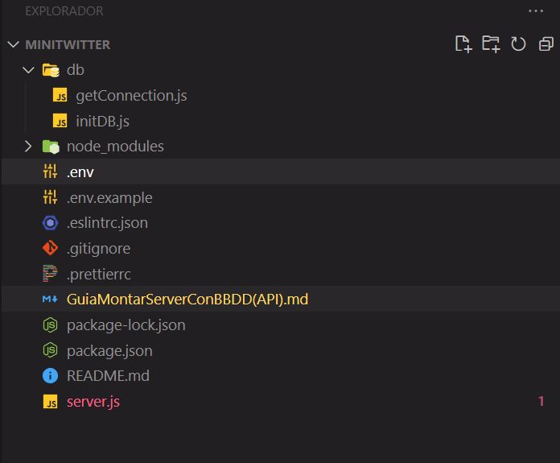

# Guia para montar una BBDD

## Fase Conceptual

### - Diseño de la base de datos.

Antes de empezar a picar codigo, se debe tener claro el diseño de la API.

Como minimo tener claros dos puntos:

-   Cuál será la estructura de nuestra base de datos.

-   Qué endpoints necesitamos.

#### - README

Para todos los proyectos, tanto de backend y frontend, deben tener un README explicando:

-   Como instalar el backend
-   Que entidades tienen la BBDD
-   Que endpoints vamos a tener.

&nbsp;

**Esta informacion debe estar lista antes de empezar a escribir codigo.**

## Empezamos a picar codigo

## -> **1.** Lo primero es generar el 'package.json'

Con el comando

```bash
npm init -y
```

Con este fichero podemos volver a instlar todas las dependencias necesarias para instalarlas al proyecto mediante 'npm i'

&nbsp;

## -> **2.** Dependencias

No hacen falta instalarlas todas de golpe, podemos instalarlas segun vayan haciendo falta.

Las dependencias no son obligatorias pero facilitan la vida.

-   Una vez terminen de instalar, se crea la carpeta **'node_modules'**, donde se encuentran instalados todos los modulos de node, la introducimos esta carpeta en el fichero .gitignore

-   En el archivo 'package.json' podemos encontrar informacion de las dependencias instaladas.

Desde la propiedad JSON de 'scripts' podemos establecer shorcouts.

-   Inicializar DB:
    ```JSON
        "scripts" : {
        "db" : "node ./db/initDB"
        },
    ```
    ```bash
        npm run db
    ```
-   Lanzar Servidor:

    ```JSON
        "scripts": {
        "dev": "nodemon ./server.js"
        },
    ```

    ```bash
    npm run dev
    ```

### . Dependencias de desarrollo

-   prettier
-   eslint
-   nodemon

```bash
    npm i -D prettier eslint nodemon
```

### . Dependencias normales

-   [**mysql2**](https://www.npmjs.com/package/mysql2) -> Para poder conectarnos a BBDD MySQL

    -   mysql2 tiene version sincrona y asincrona.

    -   Aunque la version sincrona funciona bien y no habra problema en usarlo a dia de hoy, puede dar alguna incompatibilidad con alguna dependencia

    ```bash
    npm i mysql2
    ```

-   [**dotenv**](https://www.npmjs.com/package/dotenv) -> Permite declarar variables como variables de entorno de forma sencilla.

    ```bash
    npm i dotenv
    ```

<!-- #### Finally unistalled -->

-   [**bcrypt**](https://www.npmjs.com/package/bcrypt) -> Permite encriptar contraseñas

    ```bash
    npm i bcrypt
    ```

-   [express](https://www.npmjs.com/package/express) -> Extension del modulo http para montar servidores web, pero de forma mas sencilla.

    ```bash
    npm i express
    ```

-   [morgan](https://www.npmjs.com/package/morgan) -> Encargado de procesar información de todos los eventos que ocurren en un servidor web

    -   Se puede usar como _middleware_
    -   Puede usarse para imprimir por pantalla datos de cada petición sin tener que hacer un `console.log`

        ```bash
        npm i morgan
        ```

-   JSON WEB TOKEN
-   express-fileupload -> npm i express-fileupload
-   sharp
-   uuid -> genera mini IDs
    &nbsp;

## -> **3.** Crear una conexión con nuestra BBDD y Montar la BBDD

-   Creamos carpeta: 'db'
-   Creamos fichero: 'db/getConnection.js' -> Creamos la conexion.
-   Creamos fichero: 'db/initDB.js' -> montamos la BBDD.
-   Dependencias requeridas:
    -   [**mysql2**](https://www.npmjs.com/package/mysql2)
    -   [**dotenv**](https://www.npmjs.com/package/dotenv)
    -   [**bcrypt**](https://www.npmjs.com/package/bcrypt)

&nbsp;

### > **3. | A .** Creamos la conexion en fichero: _'db/getConnection.js'_

Con este fichero podemos establecer conexion con la BBDD

```javascript
// Vamos a establecer un limite de 10 conexiones a la BBDD
const mysql = require('mysq2/promise');

// Variable que almacenara un pool (un listado) de conexiones.
let pool;

// Funcion que retorna una conexión libre
const getDB = async () => {
    try {
        // Si no hay un pool de conexiones lo creamos.
        if (!pool) {
            pool = mysql.createPool({
                connectionlimit: 10,
                host: 'localhost',
                user: 'demo',
                password: '123456',
                database: 'minitwitter',
                timezone: 'Z',
            });
        }

        // Retornamos una conexion libre
        return await pool.getConnection();
    } catch (err) {
        console.error(err);
        throw new Error('Error al conectar con MySQL');
    }
};

// Exportamos la funcion.
module.exports = getDB;
```

-   Modulo [mysql2](https://www.npmjs.com/package/mysql2) guarda informacion que nos llega desde el cliente en una BBDD.

-   mysql.createPool();_ y \_pool.getConnection();_ -> Son metodos de la dependencia de **mysql2**

-   mysql.createPool(); -> Recibe los datos de la BBDD para poder acceder.

&nbsp;

#### > **3.A. | i .** Dependencia [_dotenv_](https://www.npmjs.com/package/dotenv)

El en fichero _'db/getConnection.js'_ tenemos reflejada informacion que deberia ser privada:

```javascript
pool = mysql.createPool({
    //connectionlimit: 10,
    host: 'localhost',
    user: 'demo',
    password: '123456',
    database: 'minitwitter',
    //timezone: 'Z',
});
```

Por ello usaremos la dependencia _dotenv_ para almacenar estos datos en _'process.env'_

1. Creamos el fichero **'.env'** en la raiz del proyecto
2. Rellenamos el fichero con aquellas variables que queremos poner como variables de entorno en el proceso ('process.env')
    ```text
     PORT=4000
     MYSQL_HOST= localhost
     MYSQL_USER=demo
     MYSQL_PASS=123456
     MYSQL_DB=minitwitter
    ```
3. Importamos 'dotenv' en el fichero donde queremos usarlo (_'/db/getConnection.js'_ en este caso)

```javascript
const dotenv = require('dotenv');
```

4. Ponemos disponible las variables que encuentre en .env mediante el metodo _'dotenv.config();'_

```javascript
// El metodo "config" localiza el fichero ".env" que hayamos creado en la raiz del proyecto y pone disponibles las variables que figuren en ese fichero (a traves de process.env)

dotenv.config();
```

```javascript
//Normalmente estos dos puntos anteriores se realizan juntos en la misma linea.

require('dotenv').config();
```

5. Importamos las variables creadas en _'.env'_

Una vez ponemos las variables del fichero _'.env'_ disponibles en las **variables de entorno**, podemos importarlas accediendo a ellas mediante _'process.env'_ / (Estas variables son ajenas a NODE, ya que pertenecen al proceso que se encuentra corriendo en la maquina al ejecutar el fichero).

-   Importamos mediante destructuring desde el objeto _'process.env'_

```javascript
// Importamos variables '.env' como variables de entorno mediante 'process.env'

const { MYSQL_HOST, MYSQL_USER, MYSQL_PASS, MYSQL_DB } = process.env;
```

-   Sustituimos las variables visibles por las _'.env'_

```javascript
pool = mysql.createPool({
    connectionlimit: 10, // Vamos a establecer un limite de 10 conexiones a la BBDD
    host: MYSQL_HOST,
    user: MYSQL_USER,
    password: MYSQL_PASS,
    database: MYSQL_DB,
    timezone: 'Z',
});
```

6. Introducimos el fichero '.env' en el '.gitignore'
   y creamos '.env.example'.

### > Estado final del fichero 'db/getConnection.js'

```javascript
const mysql = require('mysql2/promise');

// Importamos el modulo 'dotenv' con el metodo "config", que localiza el fichero ".env" que hayamos creado en la raiz del proyecto y pone disponibles las variables que figuren en ese fichero (a traves de process.env)
require('dotenv').config();

// Importamos variables '.env' como variables de entorno mediante 'process.env' haciendo destructuring
const { MYSQL_HOST, MYSQL_USER, MYSQL_PASS, MYSQL_DB } = process.env;

// Variable que almacenara un pool (un listado) de conexiones.
let pool;

// Función que retorna una conexión libre
const getDB = async () => {
    try {
        // Si no hay un pool de conexiones lo creamos.
        if (!pool) {
            pool = mysql.createPool({
                connectionlimit: 10, // Vamos a establecer un limite de 10 conexiones a la BBDD
                host: MYSQL_HOST,
                user: MYSQL_USER,
                password: MYSQL_PASS,
                database: MYSQL_DB,
                timezone: 'Z',
            });
        }

        // Retornamos una conexion libre
        return await pool.getConnection();
    } catch (err) {
        console.error(err);
        throw new Error('Error al conectar con MySQL');
    }
};

// Exportamos la funcion.
module.exports = getDB;
```

### > **3. | B .** Inicializamos (montamos) la BBDD creando el fichero _'db/initDB.js'_

Inicializar o montar BBDD.

De cara a presentar un proyecto, podemos ahorrar a quien esta visualizando nuestro proyecto el paso de tener que crear las tablas de nuestra BBDD, por lo que vamos a crear un fichero con el que se pueda montar nuestra BBDD con un simple comando.

    OJO: Cada vez que se ejecute este archivo, eliminara todo contenido de la BBDD y lo volvera a crear.

**(Como minimo quien se descargue nuestro proyecto debera crear la BBDD, posteriormente, con este fichero se podrá montar automaticamente)**

&nbsp;

1. Establecer la conexión con la BBDD

Importamos el modulo (fichero) creado por nosotros 'getConnection' creamos el fichero para inicializar la BBDD

```javascript
const getConnection = require('./getConnectionget');

async function main() {
    let connection; // Variable que almacenara una conexion libre con la base de datos.

    try {
        connection = await getConnection(); // Intentamos conectarnos
        console.log('Conexion establecida');
    } catch (err) {
        console.error(err);
    } finally {
        if (connection) connection.release(); // En cualquier caso (conectarse o no), cerramos y liberamos la conexión
        process.exit(); // Una vez se conecte y monte la BBDD cierra el proceso de este fichero.
    }
}

// Ejecutamos la funcion anterior
main();
```

2.  Creamos las tablas

-   Usaremos el metodo '.query()' del modulo de ['mysql2'](https://www.npmjs.com/package/mysql2):

    -   Usamos el metodo query de la conexion (let connection) | (query es una petición a la BBDD)
    -   El metodo query solo permite hacer una query sobre una conexion.

-   Como si se tratase de SQL usamos las querys para ejecutar codigo de gestor MYSQL.

    Ejemplo:

    ```javascript
    await connection.query(`DROP TABLE IF EXISTS users`);

    await connection.query(`
        CREATE TABLE IF NOT EXISTS users (
            id INT UNSIGNED PRIMARY KEY AUTO_INCREMENT,
            username VARCHAR(30) UNIQUE NOT NULL,
            email VARCHAR(100) UNIQUE NOT NULL,
            password VARCHAR(100) NOT NULL, 
            createdAt TIMESTAMP NOT NULL
        )
    `);
    ```

3.  Insertamos un usuario tipo Administrador.

    Al insertar la fecha en formato ZULÚ, de forma autogenerada genera un conflicto por la zona horaria.

    ```javascript
    await connection.query(`
                INSERT INTO users (username, email, password, role)
                VALUES ( 'admin', 'admin@admin.com', '123456', 'admin')
        `);

    console.log('Usuario administrador creado!');
    ```

    ```bash
    # Respuesta del terminal al ejecutar codigo

    Error: Field 'createdAt' doesn't have a default value,
    sqlMessage: "Field 'createdAt' doesn't have a default value",
    ```

    -   Asi que, introducimos la fecha de forma manual usando interrogacion '?'.
        -   Metodo mas seguro que usar el dolar '$', ya que evita la inyeccion de codigo maligno desde el FRONTEND.
        -   El metodo _'query'_ se encarga de convertir el dato a formato MYSQL

    ```javascript
    await connection.query(
        `
                    INSERT INTO users (username, email, password, role, createdAt)
                    VALUES ( 'admin', 'admin@admin.com', '123456', 'admin', ?)
            `,
        [new Date()] // Cuando insertemos datos manualmente, se puede indicar un '?' en los VALUES y posteriormente indicar, mediant array de valores, el valor que queremos darle a ese registro.
    );

    console.log('Usuario administrador creado!');
    ```

4.  Codificar contraseñas usando la dependencia

    -   Importamos la dependencia
    -   Usamos el metodo 'hash()' de bcrypt
    -   Pasamos la contraseña encriptada a la query de la creacion del usuario Admin

    ```javascript
    const bcrypt = require('bcrypt');

    const hashedPassword = await bcrypt.hash('123456', 10);

    //    Al insertar la fecha en formato ZULÚ, de forma autogenerada genera un conflicto por la zona horaria.
    await connection.query(
        `
                    INSERT INTO users (username, email, password, role, createdAt)
                    VALUES ( 'admin', 'admin@admin.com', ?, 'admin', ?)
            `,
        [hashedPassword, new Date()] // Cuando insertemos datos manualmente, se puede indicar un '?' en los VALUES y posteriormente indicar, mediant array de valores, el valor que queremos darle a ese registro.
    );
    ```

5.  Por ultimo, como 'initDB' es el fichero que inicia el proceso de montar la BBDD, por eficiencia de codigo pordemos traer la sentencia que indicamos en 'getConnection'

```javascript
// Importamos el modulo 'dotenv' con el metodo "config", que localiza el fichero ".env" que hayamos creado en la raiz del proyecto y pone disponibles las variables que figuren en ese fichero (a traves de process.env)
require('dotenv').config();
```

Dado que por cascada ya esas variables se encuentran cargadas. Al ejecutarse todo el programa en conjunto " se forma un solo fichero " con el codigo dispuesto en orden.

&nbsp;

/////////////////////

### > Estado final del fichero _'db/initDB.js'_

```javascript
// Importamos el modulo 'dotenv' con el metodo "config", que localiza el fichero ".env" que hayamos creado en la raiz del proyecto y pone disponibles las variables que figuren en ese fichero (a traves de process.env)
require('dotenv').config();

const getConnection = require('./getConnection.js');
const bcrypt = require('bcrypt');

async function main() {
    let connection; // Variable que almacenara una conexion libre con la base de datos.

    try {
        connection = await getConnection(); // Intentamos conectarnos

        console.log('Creando tablas...');

        //          -> Usamos el metodo query de la conexion (let connection) | (query es una petición a la BBDD)
        //          -> El metodo query solo permite hacer una query sobre una conexion.

        await connection.query(`DROP TABLE IF EXISTS likes`);
        await connection.query(`DROP TABLE IF EXISTS tweets`);
        await connection.query(`DROP TABLE IF EXISTS users`);

        await connection.query(`
            CREATE TABLE IF NOT EXISTS users (
                id INT UNSIGNED PRIMARY KEY AUTO_INCREMENT,
                username VARCHAR(30) UNIQUE NOT NULL,
                email VARCHAR(100) UNIQUE NOT NULL,
                password VARCHAR(100) NOT NULL,
                avatar VARCHAR(100),
                role ENUM('admin', 'normal') DEFAULT 'normal',
                createdAt TIMESTAMP NOT NULL
            )
        `);

        await connection.query(`
            CREATE TABLE IF NOT EXISTS tweets (
                id INT UNSIGNED PRIMARY KEY AUTO_INCREMENT,
                idUser INT UNSIGNED NOT NULL,
                FOREIGN KEY (idUser) REFERENCES users (id),
                text VARCHAR(250) NOT NULL,
                image VARCHAR(100),
                createdAt TIMESTAMP NOT NULL
            )
        `);

        await connection.query(`
            CREATE TABLE IF NOT EXISTS likes (
                id INT UNSIGNED PRIMARY KEY AUTO_INCREMENT,
                value BOOLEAN DEFAULT true,
                idUser INT UNSIGNED NOT NULL,
                FOREIGN KEY (idUser) REFERENCES users (id),
                idTweet INT UNSIGNED NOT NULL,
                FOREIGN KEY (idTweet) REFERENCES tweets (id),
                createdAt TIMESTAMP NOT NULL
            )
        `);

        console.log('Tablas creadas!');

        // Encriptamos la contraseña del usuario administrador con la dependencia 'bcrypt'
        const hashedPassword = await bcrypt.hash('123456', 10);

        //    Al insertar la fecha en formato ZULÚ, de forma autogenerada genera un conflicto por la zona horaria.
        await connection.query(
            `
                INSERT INTO users (username, email, password, role, createdAt)
                VALUES ( 'admin', 'admin@admin.com', ?, 'admin', ?)
        `,
            [hashedPassword, new Date()] // Cuando insertemos datos manualmente, se puede indicar un '?' en los VALUES y posteriormente indicar, mediant array de valores, el valor que queremos darle a ese registro.
        );

        console.log('Usuario administrador creado!');
    } catch (err) {
        console.error(err);
    } finally {
        if (connection) connection.release(); // En cualquier caso (conectarse o no), cerramos y liberamos la conexión
        process.exit(); // Una vez se conecte y monte la BBDD cierra el proceso de este fichero.
    }
}

// Ejecutamos la funcion anterior
main();
```

## -> **4.** Creamos el servidor

-   Creamos el fichero 'server.js'

-   Dependencias requeridas
    -   nodemon
    -   express
    -   morgan

&nbsp;

-   **Creamos fichero 'server.js'**

En este fichero lanzaremos el server y lo pondremos a escuchar peticiones.

```javascript
// Esta sentencia podria y seria mas eficiente que se introdujera en 'initDB'
/* require('dotenv').config(); // Metodo config pone disponibles las variables del archivo .env como variables de entorno. */

const express = require('express');
const morgan = require('morgan');

// Cargamos el puerto correspondiente desde el process.env -> metodo dotenv
const { PORT } = process.env;

// Creamos un servidor con express
const app = express();

// Middleware que hqace uso del logger "morgan"
app.use(morgan('dev'));

// Middleware de nod found
app.use((req, res) => {
    res.status(404).send({
        status: 'ok',
        message: 'Not found!',
    });
});

// Ponemos al servidor a escuchar en el puerto configurado.
app.listen(PORT, () => {
    console.log(`Server listenin at http://localhost:${PORT}`);
});
```

En el estado actual el server esta escuchando pero no va a responder mas que con el ENDPOINT de error. Pero se podria considerar la estructura de inicio basica de server.js.

-   **Añadimos la dependencia de Morgan**

```javascript
// Middleware que hqace uso del logger "morgan"
app.use(morgan('dev'));
```

&nbsp;

### > **4. | A.** Registro de un usuario

-   Para hacer un registro y mantener la privacidad de los datos que se recogen desde el cliente:

    -   Debe ser una peticion POST
    -   Recoger los datos desde el _body_
    -   Para que esos datos sean legibles por NODE se deben deserializar. -> Metodo de express'_app.use(express.json());_'

        ```javascript
        // Middleware que deserializa el body y lo pone disponible en "req.body"
        app.use(express.json());

        // Registro de un nuevo usuario 4.| A.
        app.post('/users', async (req, res) => {
            try {
                // Obtenemos los campos del body.
                const { username, email, password } = req.body;

                // Respuesta de testing
                res.send({
                    status: 'ok',
                    message: 'Usuario creado',
                    body: req.body,
                });
            } catch (err) {
                console.error(err);
            }
        });
        ```

        Postman devuelve esta respuesta:

        ```JSON
        {
            "status": "ok",
            "message": "Usuario creado",
            "body": {
                "username": "david95",
                "email": "david95@gmail.com",
                "password": "123456"
            }
        }
        ```

        Si falta algun campo requerido para el registro, lanzamos error.

        ````javascript
                // Si falta algun campo lanzamos un error
            if (!username || !email || !password) {
                // Si el usuario no nos hace llegar alguno de estos campos, lanzamos error
                const err = new Error('Faltan campos'); // Creamos un error
                err.statusCode = 400; // Nos inventamos un nombre de propiedad para err donde alojaremos el codigo de error.
                throw err;
            }
            ```

        ````

    2.  Middleware de error

        -   Cualquier error que lanzemos nosotros o que lance el servidor tiene que terminar siempre en el middlewar de error.

        -   Se coloca antes del not found

        -   Se añaden, a los endpoints donde puedan surgir error, el parametro '_next_', para que en su catch en caso de surgir error, enviarlo al middleware de error

        -   _err.statusCode_, propiedad creada por nosotros para los errores generados por el programador

        -   Los errores generados por el servidor no tendran la propiedad 'statusCode', ya que nos la inventamos nosotros en la linea 28 y dara undefined. Por defecto los errores de servidor tienen el codigo 500.

        ```javascript
        // Registro de un nuevo usuario 4.| A.
        app.post('/users', async (req, res, next) => {
            try {
                // Obtenemos los campos del body.
                const { username, email, password } = req.body;

                // Si falta algun campo lanzamos un error
                if (!username || !email || !password) {
                    // Si el usuario no nos hace llegar alguno de estos campos, lanzamos error
                    const err = new Error('Faltan campos'); // Creamos un error
                    err.statusCode = 400; // Nos inventamos un nombre de propiedad para err donde alojaremos el codigo de error.
                    throw err;
                }

                res.send({
                    status: 'ok',
                    message: 'Usuario creado',
                    body: req.body,
                });
            } catch (err) {
                /* console.error(err); -> No es necesario porque los errores se mandan al middleware de error , donde ya tienen su propio console.*/
                next(err); // Lanza el error al middleware de error
            }
        });

        // Middleware de error
        app.use((err, req, res, next) => {
            console.error(err);

            res.status(err.statusCode || 500).send({
                status: 'error',
                message: err.message,
            });
        });
        ```

        -   Middleware de error tiene dos nuevos parametros:
            -   _err_ -> es el error que le enviamos nosotros despues de surgir en algun endpoint
            -   next -> no se usa pero se requiere para que funcione. **importante**

#### Estado previo modularizacion 'server.js'

```javascript
require('dotenv').config(); // Metodo config pone disponibles las variables del archivo .env como variables de entorno.

const express = require('express');
const morgan = require('morgan');

// Cargamos el puerto correspondiente desde el process.env -> metodo dotenv
const { PORT } = process.env;

// Creamos un servidor con express
const app = express();

// Middleware que hqace uso del logger "morgan"
app.use(morgan('dev'));

// Middleware que deserializa el body y lo pone disponible en "req.body"
app.use(express.json());

// Registro de un nuevo usuario 4.| A.
app.post('/users', async (req, res, next) => {
    try {
        // Obtenemos los campos del body.
        const { username, email, password } = req.body;

        // Si falta algun campo lanzamos un error
        if (!username || !email || !password) {
            // Si el usuario no nos hace llegar alguno de estos campos, lanzamos error
            const err = new Error('Faltan campos'); // Creamos un error
            err.statusCode = 400; // Nos inventamos un nombre de propiedad para err donde alojaremos el codigo de error.
            throw err;
        }

        res.send({
            status: 'ok',
            message: 'Usuario creado',
            body: req.body,
        });
    } catch (err) {
        /* console.error(err); -> No es necesario porque los errores se mandan al middleware de error , donde ya tienen su propio console.*/
        next(err); // Lanza el error al middleware de error
    }
});

// Middleware de error
app.use((err, req, res, next) => {
    console.error(err);

    // err.statusCode para los errores generados por el programador
    // Los errores generados por el servidor no tendran la propiedad 'statusCode', ya que nos la inventamos nosotros en la linea 28 y dara undefined. Por defecto los errores de servidor tienen el codigo 500.
    res.status(err.statusCode || 500).send({
        status: 'error',
        message: err.message,
    });
});

// Middleware de not found
app.use((req, res) => {
    res.status(404).send({
        status: 'ok',
        message: 'Not found!',
    });
});

// Ponemos al servidor a escuchar en el puerto configurado.
app.listen(PORT, () => {
    console.log(`Server listenin at http://localhost:${PORT}`);
});
```

#### Sistema de ficheros

A la hora de programar siempre hay una estructura de directorios que hay que seguir.

Tal y como lo tenemos hasta este punto no es lo mas optimo. Dado que aun no esta todo el codigo escrito,
se volveran muchas lineas y hay codigo que se puede reutilizar en otros componentes del server.



&nbsp;

Es por ello que hay que **modularizar** el codigo.

-   Los módulos son “pequeños” fragmentos de código muy especializados

-   Los módulos son “independientes” y reemplazables por otros

-   Los módulos tienen dependencias entre sí, en ocasiones cruzadas

-   Los módulos permiten encapsular mucha lógica en forma de cajas negras

-   Una buena modularización permite subir el nivel de abstracción de una aplicación

-   Existen muchas formas de gestionar la carga y dependencia de módulos en JavaScript

-   Cuidado con: interdependencias entre módulos, ruido en cada fichero, dificultad de entender código y mucho más refactorizar.

&nbsp;

#### 4. | M.00 - Modularizacion de nuestro codigo

-   'controllers' albergara **todo** el codigo constructor de 'users' y 'tweets'
-   'db' albergara todas las funciones que se conecten a la BBDD las crearemos en db

##### M.01 - Creamos la carpeta 'controllers'.

##### a) 'controllers/users':

1. **'newUser.js'**-> Funcion de registro de usuarios. (Tomar los datos del usuario)

    - La funcion que registra usuarios, es bastante recurrente, por lo que podria convertirse perfectamente en un modulo.

    - Creamos el fichero _'controllers/users/newUser.js'_ donde **encapsulamos** la funcion que **_registra a los usuarios._**

    &nbsp;

    ```javascript
    const newUser = async (req, res, next) => {
        try {
            // Obtenemos los campos del body.
            const { username, email, password } = req.body;

            // Si falta algun campo lanzamos un error
            if (!username || !email || !password) {
                // Si el usuario no nos hace llegar alguno de estos campos, lanzamos error
                const err = new Error('Faltan campos'); // Creamos un error
                err.statusCode = 400; // Nos inventamos un nombre de propiedad para err donde alojaremos el codigo de error.
                throw err;
            }

            res.send({
                status: 'ok',
                message: 'Usuario creado',
                body: req.body,
            });
        } catch (err) {
            /* console.error(err); -> No es necesario porque los errores se mandan al middleware de error , donde ya tienen su propio console.*/
            next(err); // Lanza el error al middleware de error
        }
    };

    module.exports = newUser;
    ```

    &nbsp;

    Y en contraparte, modificamos el fichero _'server.js'_ , volviendolo menos denso, mas compacto.

-   **EXPORTS** : Una vez tenemos listo el fichero, lo exportamos e importamos en donde se requiera:

    -   Server.js

    &nbsp;

    ```javascript
    /*
     *   ########################
     *   ## Endpoints Usuarios ##
     *   ########################
     */

    const newUser = require('./controllers/users/newUsers');

    // Registro de un nuevo usuario 4.| A. -> Modularizado
    app.post('/users', newUser);
    ```

##### M.02 - Creamos la carpeta 'db/userQueries'

-   Funcion que conecte con la BBDD y dados los datos recogidos por el modulo 'controllers/users/newUsers.js', cree el usuario

1. **'insertUserQuery.js'** -> Funcion que cree al usuario en la BBDD

    - Modulo que conecta a BBDD y devuelve coincidencias de usuarios ya registrados que tengan mismo email o username.
    - Como es una funcion que se conecta a BBDD, la creamos en la carpeta 'db'
    - Funcion interconectada con otros modulos

    ```javascript
    const getConnection = require('../getConnection');
    const bcrypt = require('bcrypt');

    const insertUserQuery = async (username, email, password) => {
        let connection;
        try {
            connection = await getConnection();

            // Obtenemos un array de usuarios en base al email  -> Comprobar que no se repita email
            const [emailUsers] = await connection.query(
                'SELECT id FROM users WHERE email = ?',
                [email]
            );

            // Si existe algun usuario con ese email lanzamos un error
            if (email.length > 0) {
                const err = new Error(
                    'Ya existe un usuario con ese email en la base de datos'
                );
                err.statusCode = 403;
                throw err;
            }

            // Obtenemos un array de usuarios en base al username  -> Comprobar que no se repita username
            const [usernameUsers] = await connection.query(
                'SELECT id FROM users WHERE username = ?',
                [username]
            );

            // Si existe algun usuario con ese username lanzamos un error
            if (usernameUsers.length > 0) {
                const err = new Error(
                    'Ya existe un usuario con ese username en la base de datos'
                );
                err.statusCode = 403;
                throw err;
            }

            // Encriptamos la contraseña
            const hashedPassword = bcrypt.hash(password, 10);

            // Creamos el usuario
            await connection.query(
                `INSERT INTO users (username, email, password, createdAt) VALUES (?, ?, ?, ?)`,
                [username, email, hashedPassword, new Date()]
            );
        } finally {
            /* catch (error) -> No hace falta catch , porque usa el de 'controllers/users/newUser.js'*/
            if (connection) connection.release();
        }
    };

    module.exports = insertUserQuery;
    ```

    - Al realizar SELECT sobre el metodo _query_ , este devuelve un array de arrays, siendo el primer resultado, un array de objetos el que contiene los resultados de nuestro SELECT

    ```javascript
    [
        [
            TextRow {
                id: 1,
                place: 'A Coruña',
                description: 'Lorem ipsum dolor amet.',
            }
        ],
        [
            ColumnDefinition {
                _buf: <Buffer 01 00 00 01 06 34 00 ... 416 more  bytes>,
                encoding: 'binary',
                name: 'id',
                ...
            },
            ColumnDefinition {
                _buf: <Buffer 01 00 00 01 06 34 00 ... 416 more  bytes>,
                encoding: 'utf8',
                name: 'place',
                ...
            },
            ColumnDefinition {
                _buf: <Buffer 01 00 00 01 06 34 00 ... 416 more  bytes>,
                encoding: 'utf8',
                name: 'description',
                ...
            }
        ]
    ]
    ```

    - Mediante destructuring podemos quedarnos con ese primer array y desechar todos los demas.

    ```javascript
    const resultadoQuery = await connection.query(/* Codigo del SELECT */);

         resultadoQuery =  [
                                TextRow {
                                        id: 1,
                                        place: 'A Coruña',
                                        description: 'Lorem ipsum dolor amet.',
                                        }
                            ]
    ```

    - **IMPORTS**: Dado que existe codigo que se repite de forma constante en el fichero que acabamos de crear:

        ```javascript
        const err = new Error(
            'Ya existe un usuario con ese email en la base de datos'
        );
        err.statusCode = 403;
        throw err;
        ```

        Es optimo crear un modulo para ese trozo de codigo:
        -> 'helpers.js'

        ```javascript
        const generateError = (message, code) => {
            const err = new Error(message);
            err.statusCode = code;
            return err;
        };

        module.exports = generateError;
        ```

        Despues de modularizar esas lineas de codigo, el fichero 'insertUserQuery.js' queraria de esta manera:

        ```javascript
        const getConnection = require('../getConnection');
        const bcrypt = require('bcrypt');

        const generateError = require('../../helpers');

        const insertUserQuery = async (username, email, password) => {
            let connection;
            try {
                connection = await getConnection();

                // Obtenemos un array de usuarios en base al email  -> Comprobar que no se repita email
                const [emailUsers] = await connection.query(
                    'SELECT id FROM users WHERE email = ?',
                    [email]
                );

                // Si existe algun usuario con ese email lanzamos un error
                if (email.length > 0) {
                    throw generateError(
                        'Ya existe un usuario con ese email en la base de datos',
                        403
                    );
                }

                // Obtenemos un array de usuarios en base al username  -> Comprobar que no se repita username
                const [usernameUsers] = await connection.query(
                    'SELECT id FROM users WHERE username = ?',
                    [username]
                );

                // Si existe algun usuario con ese username lanzamos un error
                if (usernameUsers.length > 0) {
                    throw generateError(
                        'Ya existe un usuario con ese username en la base de datos',
                        403
                    );
                }

                // Encriptamos la contraseña
                const hashedPassword = bcrypt.hash(password, 10);

                // Creamos el usuario
                await connection.query(
                    `INSERT INTO users (username, email, password, createdAt) VALUES (?, ?, ?, ?)`,
                    [username, email, hashedPassword, new Date()]
                );
            } finally {
                /* catch (error) -> No hace falta catch , porque usa el de 'controllers/users/newUser.js'*/
                if (connection) connection.release();
            }
        };

        module.exports = insertUserQuery;
        ```

        &nbsp;

    - **EXPORTS** : Una vez tenemos listo el fichero, lo exportamos e importamos en donde se requiera:

        - controllers/users/newUser.js

        ```javascript
        const insertUserQuery = require('../../db/userQueries/insertUserQuery');

        const newUser = async (req, res, next) => {
            try {
                // Obtenemos los campos del body.
                const { username, email, password } = req.body;

                // Si falta algun campo lanzamos un error
                if (!username || !email || !password) {
                    // Si el usuario no nos hace llegar alguno de estos campos, lanzamos error
                    const err = new Error('Faltan campos'); // Creamos un error
                    err.statusCode = 400; // Nos inventamos un nombre de propiedad para err donde alojaremos el codigo de error.
                    throw err;
                }

                // Insertamos un nuevo usuario en la BBDD
                await insertUserQuery(username, email, password); // -> Modulo importado. Funcion controladora

                res.send({
                    status: 'ok',
                    message: 'Usuario creado',
                    body: req.body,
                });
            } catch (err) {
                /* console.error(err); -> No es necesario porque los errores se mandan al middleware de error , donde ya tienen su propio console.*/
                next(err); // Lanza el error al middleware de error
            }
        };

        module.exports = newUser;
        ```

### > **4. | B.** Login de usuarios

Añadimos en la seccion de 'Endpoints Usuarios' del fichero 'server.js'; _la query_.

```javascript
// Login de usuario
app.post('/users/login');
```

-   Creamos una query que me devuelva usuarios por emal -> 'db/userQueries/selectUserByEmailQuery.js

    ```javascript
    const getConnection = require('../getConnection');

    const generateError = require('../../helpers');

    const selectUserByEmailQuery = async (email) => {
        let connection;

        try {
            connection = await getConnection();

            const [users] = await connection.query(
                'SELECT id, password, role FROM users WHERE username = ?',
                [email]
            );

            if (users.length < 1) {
                throw generateError('Emain incorrecto', 404);
            }

            return users[0];
        } finally {
            if (connection) connection.release();
        }
    };

    module.exports = selectUserByEmailQuery;
    ```

-   Creamos el fichero 'controllers/users/loginUser.js" ;_ el controlador_.
-   Recogemos los datos de usuario y contraseña del body
-   Comprobamos en la BBDD que existan coincidencias con usuario; si no existe lanzamos error.
-   Comprobamos coincidencia de contraseña entre el usuario que coincida con dicho email y el que nos introduce el usuario en el login
-   Generamos token mediante dependencia JSON WEB TOKEN

```javascript
const bcrypt = require('bcrypt');
const jwt = require('jsonwebtoken');

const selectUserByEmailQuery = require('../../db/userQueries/selectUserByEmailQuery');

const generateError = require('../../helpers');

const loginUser = async (req, res, next) => {
    try {
        const { email, password } = req.body; // Recogemos el email y la contraseña desde el body

        if (!email || !password) {
            // en caso de que no existan generamos
            throw generateError('Faltan campos', 400);
        }

        // Buscamos al usuario, mediante el email que nos indica en el login a traves del body, en la BBDD
        const user = await selectUserByEmailQuery(email);

        // Comprobar si las contraseñas coinciden
        const validPassword = await bcrypt.compare(password, user.password);

        // Si las contraseñas no coinciden lanzamos un error
        if (!validPassword) {
            throw generateError('Contraseña incorrecta', 401);
        }
        // Generamos un objeto donde guardar la informacion que queremos agregar al token
        const payload = {
            id: user.id,
            role: user.role,
        };

        // Firmamos (generamos) el token -> El secreto del token debe ser informacion privada ya que es un sello de seguridad con el que se van a generar todos los tokens -> .env
        const token = jwt.sign(payload, process.env.SECRET, {
            expiresIn: '10d', // -> cuando caduta el token
        });

        res.send({
            status: 'ok',
            // Los datos que enviemos los encapsulamos en el objeto data
            data: {
                token,
            },
        });
    } catch (err) {
        next(err);
    }
};

module.exports = loginUser;
```

### > **4. | C.** Informacion del usuario logeado

Añadimos en la seccion de 'Endpoints Usuarios' del fichero 'server.js'; _la query_.

```javascript
// Info del usuario logueado
app.get('/users');
```

1. Creamos la query -> _'db\userQueries\selectUserByIdQuery.js'_

    - Buscar en la BBDD un usuario mediante su id

```javascript
const getConnection = require('../getConnection');

const generateError = require('../../helpers');

const selectUserByIdQuery = async (idUser) => {
    let connection;

    try {
        connection = await getConnection();

        const [users] = await connection.query(
            'SELECT id, username, email, role, createdAt FROM users WHERE id = ?',
            [idUser]
        );

        if (users.length < 1) {
            throw generateError('Usuario no encontrado', 404);
        }

        return users[0];
    } finally {
        if (connection) connection.release();
    }
};

module.exports = selectUserByIdQuery;
```

2. Para poder obtener que id de usuario (que esta logeado) debemos buscar en la BBDD el id que coincida con el token logeado.

-   Tenemos que **Crear un middleware**:

    -   Que examine la peticion
    -   Lo desencripte y nos de el id y rol

            Para ello vamos a crear la carpeta 'middlewares' donde alojaremos todos los middlewares creados por nosotros, **no instalados**

Creamos 'middleware/authUser'

```javascript
const jwt = require('jsonwebtoken');

const generateError = require('../helpers');

const authUser = async (req, res, next) => {
    try {
        // El token va a venir de una propiedad llamada "authorization" que esta alojada en la cabecera. Accedemos a la cabecera mediante 'rez.headers'
        const { authorization } = req.headers;

        // Si no hay token lanzamos un error
        if (!authorization) {
            throw generateError('Falta la cabecera de autorizacion', 401);
        }

        // Recuperamos las variables del 'payload' (la informacion que contiene el token) que construimos en 'loginUser'
        let payload;

        try {
            // Intentamos obtener la info del token deconstruyendolo 'jwt.verify(token,secret)'
            payload = jwt.verify(authorization, process.env.SECRET);
        } catch {
            throw generateError('Token incorrecto', 401);
        }

        // Agregamos una nueva propiedad al objeto "request" donde alojar info del payload y tener esta info disponible como variable de entorno
        req.user = payload;

        // Saltamos al siguiente controlador (En el server.js (app.get('/users', authUser, getOwnUser);))
        next();
    } catch (err) {
        next(err);
    }
};

module.exports = authUser;
```

Una vez ya tenemos el id del token que se encuentra logeado, creamos la **funcion controladora** _'controllers\users\getOwnUser.js'_

```javascript
const selectUserByIdQuery = require('../../db/userQueries/selectUserByIdQuery');

const getOwnUser = async (req, res, next) => {
    try {
        const user = await selectUserByIdQuery(req.user.id);

        res.send({
            status: 'ok',
            data: {
                user,
            },
        });
    } catch (err) {
        next(err);
    }
};

module.exports = getOwnUser;
```

Quedando en 'server.js'

```javascript
// Middleware
const authUser = require('./middlewares/authUser');

//Endpoint
app.get('/users', authUser, getOwnUser);
```

### > **4. | D.** Manejando archivos (Imagenes,PDF..)

No podemos manejar archivos a traves del formato 'raw', hay que hacerlo atraves de 'form-data'. (BODY)

Para recibir body con formato form-data es necesario deserializarlos

Dependencia -> npm i express-fileupload

1. Deserializar body con formato form-data

    - Creamos middleware

    ```javascript
    // Middleware que desserializa el body en formato "form-data"
    app.use(fileUpload());
    ```

2. Creamos la funcion -> SavePhoto en helpers.js

3. Creamos la funcion -> DeletePhoto en helpers.js

### > **4. | D.** Editar un usuario

Dependencia -> npm i sharp

1. Creamos middleware propio -> 'editUser.js'

```javascript
const selectUserByIdQuery = require('../../db/userQueries/selectUserByIdQuery');
const updateUserQuery = require('../../db/userQueries/updateUserQuery');

const { generateError, savePhoto, deletePhoto } = require('../../helpers');

const editUser = async (req, res, next) => {
    try {
        // Obtenemos los campos del body.
        let { username, email } = req.body;

        // El avatar (los archivos) vendra en 'req.files'

        // Si no hay nada que actualizar, lanzamos error
        if (!username && !email && !req.files?.avatar) {
            throw generateError('Faltan campos', 400); // Creamos un error
        }

        // Obtenemos la info del usuario desde la BBDD
        const user = await selectUserByIdQuery(req.user.id);

        // Variable donde almacenaremos el nombre de la imagen
        let avatar;

        // Si existe avatar lo guardamos en una carpeta del servidor y posteriormente
        // guardamos el nombre del archivo en la base de datos.
        if (req.files?.avatar) {
            // Si el usuario tiene un avatar asignado lo borramos del disco duro.
            if (user.avatar) {
                await deletePhoto(user.avatar);
            }

            // Guardamos el avatar en el disco duro y obtenemos el nombre.
            avatar = await savePhoto(req.files.avatar);
        }

        // Establecemos el valor final para las variables. Si no hay una nueva me quedo con la anterior.
        username = username || user.name;
        email = email || user.eamil;
        avatar = avatar || user.avatar;

        // Actualizamos los datos del usuario
        await updateUserQuery(username, email, req.user.id);

        res.send({
            status: 'ok',
            message: 'Usuario actualizado',
        });
    } catch (err) {
        /* console.error(err); -> No es necesario porque los errores se mandan al middleware de error , donde ya tienen su propio console.*/
        next(err); // Lanza el error al middleware de error
    }
};

module.exports = editUser;
```

2. Creamos la query -> 'db\userQueries\updateUserQuery.js'

    ```javascript
    const getConnection = require('../getConnection');

    const updateUserQuery = async (username, email, idUser) => {
        let connection;

        try {
            connection = await getConnection();

            await connection.query(
                `UPDATE users SET username = ?, email = ?, avatar = ? WHERE id = ?`,
                [username, email, idUser]
            );
        } finally {
            if (connection) connection.release();
        }
    };

    module.exports = updateUserQuery;
    ```

    Finalmente añadimos a server.js

    ```javascript
    const editUser = require('./controllers/users/editUser');
    // Editar un usuario
    app.put('/users', authUser, editUser);
    ```

### Crear tweets

Creamos la query

Creamos controlador

Creamos el endpoint -> server.js

### Listar tweets

-   Listar tweets
-   Filtrar tweets

creamos query

creamos controlador

creamos el endpoint

### Devolver infromacion de un tweet en concreto

creamos query

creamos controlador

creamos el endpoint

### Borrar un tweet

### Añadir/Quitar Like

### Refactorizamos mediante index.js en cada carpeta de controladores

### XXX - Helpers.js

-   Fichero cuyo objetivo es almacenar funciones especificas pero genericas.

1. generateError -> Tras crear el fichero 'db/userQueries/insertUserQueries.js' nos damos cuenta de que hay codigo repetido, realizamos funcion en helpers.

2. savePhoto

3. deletePhoto

```javascript
const fs = require('fs/promises');
const path = require('path');
const sharp = require('sharp');
const { v4: uuid } = require('uuid');

/**
 * ####################
 * ## Generate Error ##
 * ####################
 */

const generateError = (message, code) => {
    const err = new Error(message);
    err.statusCode = code;
    return err;
};

/**
 * ################
 * ## Save Photo ##
 * ################
 */

const savePhoto = async (img) => {
    // Creamos una ruta absoluta al directorio donde vamos a subir las imágenes.
    const uploadsPath = path.join(__dirname, process.env.UPLOADS_DIR);

    try {
        // Intentamos acceder al directorio de subida de archivos mediante el método "access" de fs.
        // Este método genera un error si no es posible acceder al archivo.
        await fs.access(uploadsPath);
    } catch {
        // Si salta el error quiere decir que el directorio no existe así que lo creamos.
        await fs.mkdir(uploadsPath);
    }

    // Procesamos la imagen y la convertimos en un objeto de tipo "Sharp".
    const sharpImg = sharp(img.data);

    // Redimensionamos la imagen para evitar que sean demasiado pesadas. Le asignamos un ancho
    // máximo de 500px.
    sharpImg.resize(500);

    // Generamos un nombre único para la imagen.
    const imgName = `${uuid()}.jpg`;

    // Generamos la ruta absoluta donde queremos guardar la imagen.
    const imgPath = path.join(uploadsPath, imgName);

    // Guardamos la imagen en el directorio correspondiente.
    await sharpImg.toFile(imgPath);

    // Retornamos el nombre que le hemos dado a la imagen.
    return imgName;
};

/**
 * ##################
 * ## Delete Photo ##
 * ##################
 */

const deletePhoto = async (imgName) => {
    try {
        // Creamos la ruta absoluta a la imagen que queremos borrar.
        const imgPath = path.join(__dirname, process.env.UPLOADS_DIR, imgName);

        // Eliminamos la imagen del disco.
        await fs.unlink(imgPath);
    } catch {
        throw generateError('Error al eliminar la imagen del servidor');
    }
};

module.exports = {
    generateError,
    savePhoto,
    deletePhoto,
};
```
